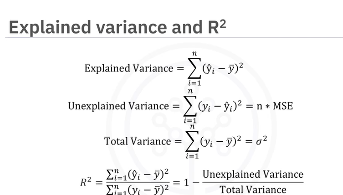
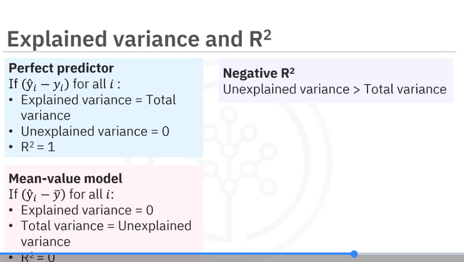

# EVALUATION TECHNIQUES 

1. CONFUSION MATRIX
it shows prdictions results

	               Predicted Positive	  Predicted Negative
Actual Positive	  True Positive (TP)	    False Negative (FN)
Actual Negative	  False Positive (FP)	 True Negative (TN)

2. ACCURACY
Overall correctness of model.

Accuracy=  TP+TN
          -----------
          TP+TN+FP+FN

Use when:
Dataset is balanced.(Cat vs Dog dataset (50–50).)
dis-can mislead(if 95%data= negative class)

Example: Handwritten Digit Recognition

(0–9 digit classification)

Each digit appears almost equally.
Both mistakes are equally bad.

Here overall correctness matters.

 Use Accuracy because:
Dataset is balanced
No special risk if model makes a mistake

Other examples:
Image classification (cats vs dogs)
Basic student pass/fail prediction
Product category classification

3. PRECISION
How many predicted positives are actually correct.

Precision=   TP
          ---------
            TP+FP

Use when:
False positives are costly.(a wrong psoitive prediction cause serios problem/ loss in real life)
(Each false positive mistake has a high real-world cost or consequence.)
(impact of the error.)ex-Fraud alerts
(Example 1 — Spam Email Detection

Positive = Spam

False Positive:

Normal email marked as spam.

💥 Cost:

Important email missed
Business loss

So false positives are costly → we prefer high precision.)

Actual	  Predicted	      Result
Negative	Positive	❌ False Positive

example-
Example: Spam Email Detection

If model marks normal email as spam:

❌ Important email may be lost.

So we ask:

“When model says SPAM, is it really spam?”

👉 Precision must be high.

✔ Use Precision when:
False alarms are dangerous.

Other examples

Fraud alerts (don’t block genuine users)
Face recognition unlocking phones
Legal document classification

4. RECALL

Out of actual positives, how many were detected

Recall=   TP
         -----
         TP+FN

Use when

Missing positives is dangerous.

Examples
Cancer detection
Security threats

👉 Catch everything important.

example-
Example: Cancer Detection

If model misses a cancer patient:

⚠️ Serious real-world harm.

So we ask:

“Did we detect ALL sick patients?”

👉 Recall must be high.

✔ Use Recall when:
Missing cases is risky.

Other examples

Fraud detection
Security threat detection
Fault detection in machines
Disaster warning systems

5. F1 SCORE

Combines precision and recall.(harmonic mean of precision and recall)

F1=2  Precision*Recall
    -------------------
     Precision+Recall
	​

Use when
 Dataset is imbalanced
 Need balance between false alarms & misses.

Most commonly used metric in real ML.

Example: 
Credit Card Fraud

Dataset:

99% normal transactions
1% fraud

Accuracy may show 99% even if model detects NO fraud.

So we balance:

Precision (avoid false alarms)
Recall (catch fraud)

👉 F1 Score is best.

✔ Use F1 when:
Imbalanced datasets
Need balance between precision & recall

Other examples

Fake news detection
Intrusion detection systems
Medical screening

6. CROSS-VALIDATION

Not a metric but a technique.

Problem

One train-test split may give lucky/unlucky results.

Solution: K-Fold Cross Validation
Split data into K parts.
Train multiple times.
Average performance.

✅ Gives stable performance estimate

College Project ML Model

Small dataset → results change depending on split.

Cross-validation:

Tests model multiple times
Gives stable performance

👉 Prevents lucky/unlucky evaluation.

✔ Use when:
Dataset is small
Comparing models
Research projects

# for my understanding
Accuracy → “How often am I right?”
Precision → “When I say YES, am I correct?”   (How many predicted positives are actually correct.)
Recall → “Did I miss anyone important?”       (Out of actual positives, how many were detected)
F1 → “Balance both.”
Cross-validation → “Can I trust my result?”

# pipeline:

Start → Accuracy
        ↓
   Precision & Recall
        ↓
        F1 Score
        ↓
 Cross Validation (trust results)

 # regression metrics and evalution techniques

it evaluates -determining how accurately it can predict conituous numerical values (example -exam grades)

error-measure of differnec between the datapoint andthe trend line generated by the algo

1. MEAN ABSOLUTE ERROR(MAE)
avg absolute differnce between the values fitted by the model and the observed historical data
       n
MAE=summation |y(i)-y(i)^hat|
      i=1
      -----------------------------
                n

2.MEAN SQUARED ERROR(MSE)
is the sum of the squared difference between the values ​fitted by the model and observed values divided by the number of historical points minus the ​number of parameters in the model

       n
MSE=summation |y(i)-y(i)^hat|^2
      i=1
      -----------------------------
                n

3.  ROOT MEAN SQAURED ERROR(RMSE)
is the square root of the MSE. ​This is a popular evaluation metric because it has the same units as the target variable, ​making it easier to interpret than MSE

RMSE=underroot of MSE

4. R^2
amount of variance in the dependent variable that the independent variable ​can explain. ​It is also called the coefficient of determination and measures the model's goodness of fit. 

        n
R^2=summation |y(i)^hat-y^_(mean)|^2
      i=1
      ------------------------------
         n
     summation |y(i)-y^_(mean)|^2
        i=1
range 0 to 1
0-badly fit model
1-perfect model

EXPLAINED VARIANCE AND R^2:

